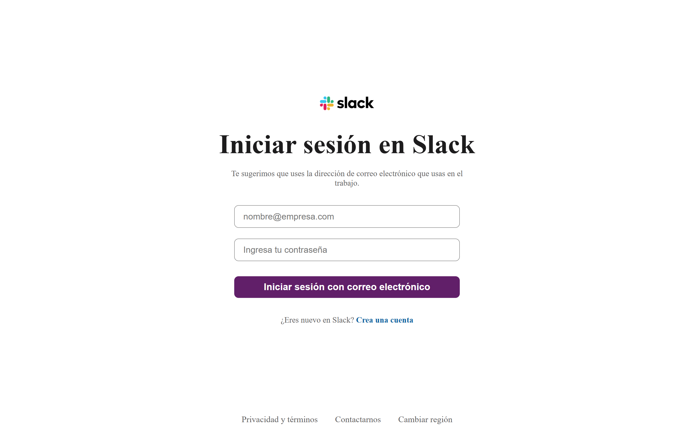
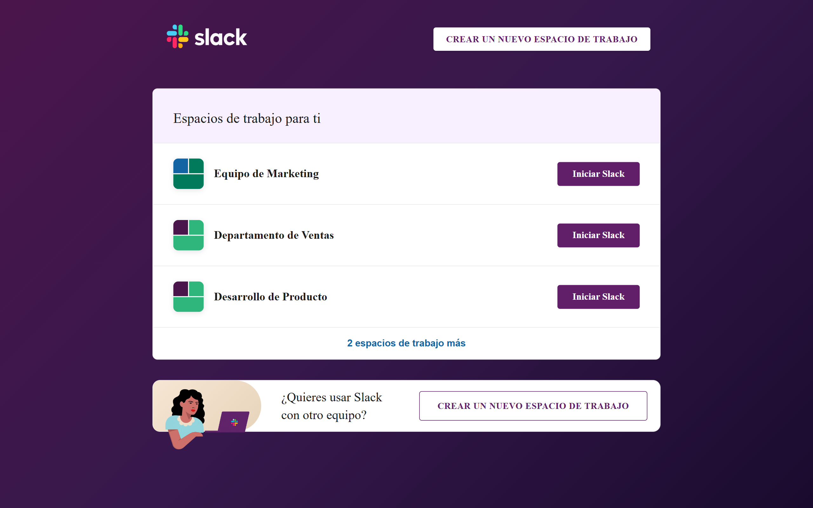
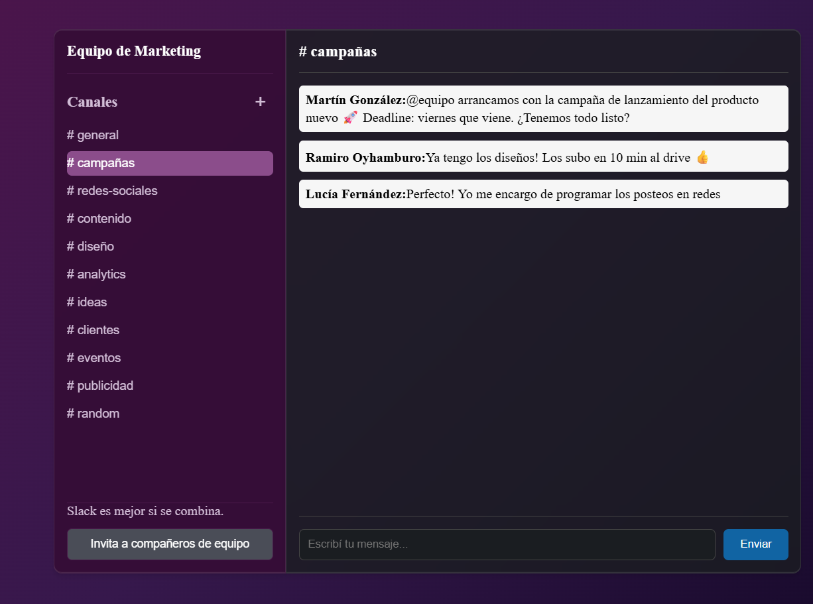
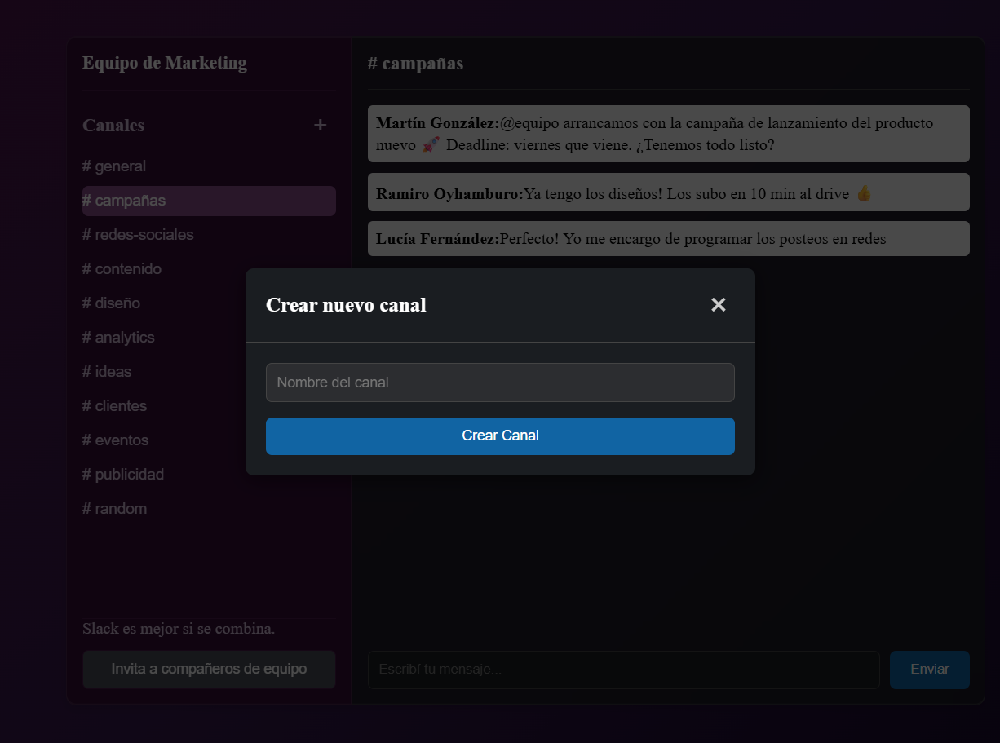

# Slack Clone - Frontend

Frontend de un clon de Slack desarrollado como proyecto final para UTN. Aplicación web full-stack construida con React y Vite, replicando la experiencia de usuario y funcionalidades principales de Slack.

> 📚 **Proyecto Académico** - Trabajo final para la certificación de Backend Developer en UTN (Universidad Tecnológica Nacional).

## 🌐 Demo en Vivo

🔗 **[Ver Demo](https://slackapp-utn.vercel.app)**

## 📸 Screenshots

### 🏠 Página de Login



### 🏢 Home - Lista de Workspaces



### 💬 Workspace - Chat y Canales



### 📢 Crear Canal



## ✨ Características Principales

- ✅ **Autenticación completa** - Registro, login y verificación de email
- 🏢 **Gestión de Workspaces** - Crear y administrar espacios de trabajo
- 📢 **Canales de comunicación** - Crear canales y organizar conversaciones
- 💬 **Chat en tiempo real** - Mensajería entre miembros del workspace
- 👥 **Sistema de invitaciones** - Invitar usuarios a workspaces vía email
- 🔒 **Rutas protegidas** - Control de acceso basado en autenticación
- 🎨 **UI/UX fiel al original** - Interfaz inspirada en Slack
- 📱 **Diseño responsivo** - Adaptado a diferentes dispositivos

## 🚀 Tecnologías

- **React 18** - Librería de UI
- **Vite** - Build tool y dev server
- **React Router DOM** - Manejo de rutas
- **CSS3** - Estilos personalizados
- **Vercel** - Deployment y hosting

## 🏗️ Arquitectura del Proyecto

El proyecto sigue una **arquitectura modular** con separación de responsabilidades:

### 📁 Estructura de Carpetas

```
slack-clone-frontend/
├── screenshots/            # Screenshots para documentación
├── src/
│   ├── assets/            # Imágenes, iconos y recursos estáticos
│   ├── components/        # Componentes reutilizables de UI
│   │   ├── Auth/         # Componentes de autenticación
│   │   ├── Workspace/    # Componentes de workspace
│   │   ├── Channel/      # Componentes de canales
│   │   └── Chat/         # Componentes de mensajería
│   ├── hooks/            # Custom hooks reutilizables
│   │   ├── useForm.js           # Manejo de formularios
│   │   ├── useFetch.js          # Peticiones HTTP con manejo de estados
│   │   ├── useChannels.js       # Lógica de gestión de canales
│   │   ├── useChannelMessage.js # Lógica de mensajes de canal
│   │   └── ...                  # Otros hooks personalizados
│   ├── pages/            # Páginas/Vistas principales
│   │   ├── LoginPage.jsx
│   │   ├── RegisterPage.jsx
│   │   ├── HomePage.jsx
│   │   ├── WorkspacePage.jsx
│   │   └── ...
│   ├── services/         # Capa de servicios (API calls)
│   │   ├── authService.js
│   │   ├── workspaceService.js
│   │   ├── channelService.js
│   │   └── messageService.js
│   ├── utils/            # Funciones utilitarias
│   ├── guards/           # Protección de rutas
│   │   └── ProtectedRoute.jsx
│   ├── config/           # Configuración de la app
│   ├── App.jsx           # Componente raíz
│   └── main.jsx          # Punto de entrada
├── public/               # Archivos públicos
├── .env                  # Variables de entorno (no incluir en git)
├── .gitignore
├── package.json
├── vite.config.js
└── README.md
```

## 🎣 Hooks Personalizados

### `useForm`

Hook para manejar formularios de forma declarativa:

```javascript
const { formState, handleChange, handleReset } = useForm({
  email: "",
  password: "",
});
```

**Funcionalidades:**

- Control de estado de inputs
- Validación en tiempo real
- Reset de formularios

---

### `useFetch`

Hook para manejar peticiones HTTP con estados automáticos:

```javascript
const { data, loading, error, fetchData } = useFetch();

// Uso
fetchData(authService.login, { email, password });
```

**Funcionalidades:**

- Loading states automáticos
- Manejo de errores centralizado
- Response handling
- Token management

---

### `useChannels`

Hook para gestionar la lógica de canales en un workspace:

```javascript
const { channels, loading, error, fetchChannels, createChannel } =
  useChannels(workspaceId);
```

**Funcionalidades:**

- Obtener lista de canales del workspace
- Crear nuevos canales
- Estados de carga y error automáticos
- Actualización de lista tras creación

---

### `useChannelMessage`

Hook para manejar mensajes dentro de un canal:

```javascript
const { messages, loading, error, fetchMessages, sendMessage } =
  useChannelMessage(channelId);
```

**Funcionalidades:**

- Cargar mensajes de un canal
- Enviar nuevos mensajes
- Actualización automática de la lista
- Manejo de estados de carga

## 🛡️ Sistema de Protección de Rutas

### `ProtectedRoute`

Componente de orden superior que protege rutas que requieren autenticación:

```jsx
<Route
  path="/workspace/:id"
  element={
    <ProtectedRoute>
      <WorkspacePage />
    </ProtectedRoute>
  }
/>
```

**Funcionamiento:**

- Verifica la existencia de token JWT en localStorage
- Redirige a `/login` si no hay token válido
- Permite acceso solo a usuarios autenticados

> ⚠️ **Nota de Seguridad**: Esta protección es a nivel UI para mejorar la experiencia de usuario. La seguridad real está implementada en el backend con middlewares de autenticación y autorización.

## 📦 Instalación y Configuración

### 1. Clonar el repositorio

```bash
git clone https://github.com/OyhamburoDev/slack-clone-frontend.git
cd slack-clone-frontend
```

### 2. Instalar dependencias

```bash
npm install
```

### 3. Configurar variables de entorno

Crear un archivo `.env` en la raíz del proyecto:

```env
VITE_API_URL=http://localhost:8080/api
```

Para producción:

```env
VITE_API_URL=https://tu-backend.vercel.app/api
```

### 4. Ejecutar en desarrollo

```bash
npm run dev
```

La aplicación estará disponible en `http://localhost:5173`

## 📜 Scripts Disponibles

```json
{
  "dev": "vite", // Inicia servidor de desarrollo
  "build": "vite build", // Genera build de producción
  "preview": "vite preview" // Preview del build de producción
}
```

## 🔄 Flujo de Usuario

### 1️⃣ Registro y Autenticación

```
Registro → Email de verificación → Verificación → Login → Token JWT
```

### 2️⃣ Gestión de Workspaces

```
Home → Crear Workspace → Ver lista de workspaces → Seleccionar workspace
```

### 3️⃣ Comunicación

```
Workspace → Ver canales → Seleccionar canal → Enviar mensajes
```

### 4️⃣ Invitaciones

```
Workspace → Invitar miembro → Email enviado → Confirmación por link
```

## 🌐 Deployment (Vercel)

El proyecto está desplegado en **Vercel** con integración continua desde GitHub.

### URL de Producción

```
https://slackapp-utn.vercel.app
```

### Configuración en Vercel

1. **Build Command:** `npm run build`
2. **Output Directory:** `dist`
3. **Install Command:** `npm install`

### Variables de Entorno en Vercel

Configurar en el dashboard de Vercel:

- `VITE_API_URL` - URL del backend en producción

## 🔗 Enlaces

- 🌐 **Demo:** [https://slackapp-utn.vercel.app](https://slackapp-utn.vercel.app)
- 💻 **Frontend Repo:** [GitHub - Frontend](https://github.com/OyhamburoDev/slack-clone-frontend)
- ⚙️ **Backend Repo:** [GitHub - Backend](https://github.com/OyhamburoDev/slack-clone-backend)
- 📡 **API Docs:** Ver README del backend

## 🎨 Decisiones de Diseño

### UI/UX

- **Fidelidad visual**: La interfaz replica la experiencia de Slack en cuanto a:

  - Sidebar con lista de workspaces y canales
  - Área de chat principal
  - Header con información del canal
  - Diseño de mensajes

- **Navegación**: Sistema de rutas que replica la estructura de Slack:

```
  /login
  /register
  /home
  /workspace/:workspace_id
  /workspace/:workspace_id/channel/:channel_id
```

### Arquitectura

- **Separación de responsabilidades**: Services para lógica de API, hooks para lógica reutilizable, components para UI
- **Single Responsibility Principle**: Cada componente y hook tiene una única responsabilidad
- **Reutilización**: Hooks y servicios diseñados para ser reutilizables en diferentes contextos

## 🔐 Seguridad

### Frontend

- ProtectedRoute para control de acceso a nivel UI
- Token JWT almacenado en localStorage
- Headers de autorización en todas las peticiones autenticadas

### Backend

La **seguridad real** está implementada en el backend con:

- **Middlewares de autenticación:** Verificación de tokens JWT
- **Middlewares de autorización:** Control de permisos en workspace, channel y member
- **Validación de permisos:** Cada endpoint valida los permisos del usuario
- **Hash de contraseñas:** Implementado con bcrypt

## 📝 Próximas Mejoras

- [ ] Implementar websockets para mensajes en tiempo real
- [ ] Agregar sistema de notificaciones
- [ ] Implementar búsqueda de mensajes
- [ ] Agregar soporte para archivos adjuntos
- [ ] Implementar hilos de conversación
- [ ] Agregar reacciones a mensajes
- [ ] Dark mode
- [ ] Tests unitarios y de integración

## 🤝 Contribuciones

Este es un proyecto académico, pero sugerencias y feedback son bienvenidos.

## 👨‍💻 Autor

**Ramiro Oyhamburo**

- GitHub: [@OyhamburoDev](https://github.com/OyhamburoDev)
- LinkedIn: [Ramiro Oyhamburo](https://www.linkedin.com/in/ramiro-oyhamburo-30b802342/)

---

## 📄 Licencia

ISC

---

⭐ **Si te gustó el proyecto, dale una estrella en GitHub!**
